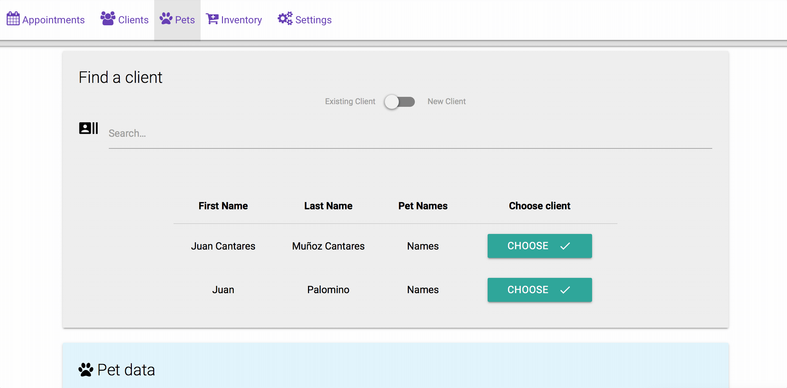

VetManager®: Cloud Veterinary Management
===================

----------

**Welcome to VetManager®!**
VetManager® is a service which allows you to manage your veterinary practice easily. You can have an ordered storage with all things that matters: clients, pets, inventory, appointments, diagnoses…

Your clients can request appointments online even adding some info/pictures about their pet problem so you can have an approach to the problem before they arrive to your clinic. 

Once you are attending them, you have the option to store everything you need without losing the focus on your daily work, the service is almost transparent to you, you can configure what data you need to save and its order. 

The web portal will be designed as responsive, so you or your clients can use it in your laptop, tablet, phone, desktop computer... The only thing you need is: internet access or a server running our VetManager® core.

----------

Highlight Features
-------------
 **IntelliSearch®:** What are you looking for? Just type it! (Name, ID, Last Name, phone…)

----------

Different access based on roles
-------------

The endpoint is the same whoever you are, your clients can access to their pet history (or not, depending your configuration) introducing some personal data. 

**Based on the role, you have the following capabilities:**

> **As veterinary:**

> - Manage all your clients, adding or updating them.
> - View and configure the appointments
> - Register the appointment's details
> - Manage your inventory and customize the reminders in order to avoid out of stock situations.
> - Check pets history.

> **As client:**

> - Request new appointments
> - Check your pet history

----------

Data entities
-------------------

 1. **Owner** 
 Personal info about client: name, owned pets, contact data…
 2. **Appointment** (N:1 Pet)
 Data containing appointment date, pet involved, subject…
 3. **Pet** (1:1 Client)
	 1. Pet details
	 2. Anamnesis / Diagnosis / Treatment (N:1 Pet)
 4. **Inventory**
List of vaccines, equipment… All the stuff used in the veterinary practice that may be wasted in time or have a maximum date to be used. 
 5. **Personnel** (N:N Pet appointment)
 6. **Settings** 
 All settings related with the veterinary clinic: Appointment configuration, veterinary practice name, reminders settings, opening hours, contact info…

----------

Internal Service
--------------------

- **Emailing service for appointment reminders**

-----------

Optional features
-------------------

1. **Access based on roles**
2. **mongoDB for Managers**

----------

3rd Party frameworks
-------------------

 - MaterializeCSS (Frontend)

----------

How to deploy
-------------

1. **Compile Sass:** You must execute mvn compile after lauch the Spring application.

----------

Contributors
-------------

 - Marcos Tenrero Morán ([@mtenrero](https://github.com/mtenrero))
 - Adrián Rubio Morlote ([@adrxx](https://github.com/adrxx))
 - Jesús Guitérrez López ([@Was17](https://github.com/Was17))

Our Trello dashboard: https://trello.com/b/d1yQOm1i/dad-development

Fase 2
===================

Page information
----------------
**Index:**    Home page of the applicationand only public page. You can access or create a user besides you can consult relevant information about the veterinary clinic.

**Dashboard:**  Main window of the private part with addresses to the four main windows  

**Client:** Page to consult all veterinary clients

**Add client:**  Page to add a new customer

**Client information:** Page for detailed customer information
 
**Pet:**   Page to consult all veterinary pets

**Add Pet:**  Page to add a new pet

**Pet information:**  Page for detailed pet information

**Appointments:**   Window in which you can see the appointments corresponding to a day, with the data of the mascot and owner. The type of visit is characterized by the color of the business card.  

**Appointments information:**  Page showing details of the appointment

**Inventory:**   Page to consult all veterinary items

**Add Item:**  Page to add a new item

**Item information:**  Page for detailed item information

**Settings:**  Page to edit basic settings
 
 Fase 3
===================

Deploying Instructions
----------------------

 1. Clone repository inside azure service using git
 `git clone https://github.com/mtenrero/vetManager.git`
 2. Compile project by typing the command (Maven must be installed) [Maven Installation instructions for Ubuntu](https://www.mkyong.com/maven/how-to-install-maven-in-ubuntu/)
 `mvn package`
 3. Setup enviroment variables to your desired values: 
 `PORT=
DB_HOST=
DB_USERNAME=
DB_PASSWORD=
MONGO_HOST=
MONGO_PORT=
MONGO_DOCUMENT=
MONGO_USERNAME=
SSL_PASSWORD=`

 4. Run .jar file located at target/vetmanager-version-SNAPSHOT.jar changing the version for the desired one
 `java -jar target/vetmanager-<version>-SNAPSHOT.jar`

Navigation chart
----------------

UML
---

Entity relationship
-------------------

